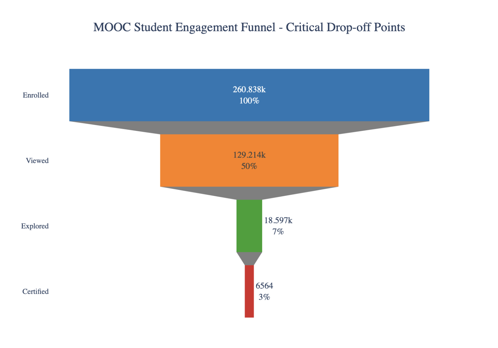
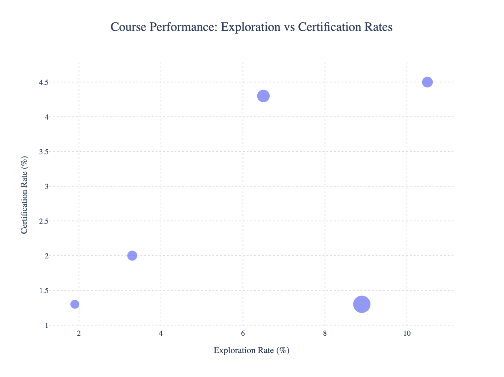

# MOOC-Student-Engagement-Analysis

The Massive Open Online Courses (MOOCs) in HarvardX and MITx online learning platforms attract hundreds of thousands of learners each year. However, despite high enrollment numbers, certification rates remain strikingly low. As someone who has enrolled in numerous online courses but completed only a few, I became curious: what actually separates the students who earn certificates from those who drop out? With MOOC completion rates hovering around just 2 to 3 percent, understanding these patterns could help millions of learners reach their educational goals.

To explore this, I conducted a student engagement analysis using a cleaned and imputed dataset containing 260,838 student records across five courses. The data includes detailed engagement metrics, demographic information, and learning activity logs. I performed exploratory data analysis using both Python and R, and then built interactive dashboards in Tableau to visualize global certification rates and demographic patterns across the platform.

This analysis offers insights that are highly relevant to EdTech companies. It identifies key factors driving certification outcomes and provides strategic recommendations that are transferable to other platforms such as Coursera, edX, and Khan Academy.

Interactive dashboards are available on my Tableau Public profile. You can explore the [global certification rate]((https://public.tableau.com/app/profile/leyan.li/viz/MOOC_Executive_Overview/Dashboard1#1)) and view [enrollment patterns by student demographics]((https://public.tableau.com/authoring/MOOC_Student_Engagement/Dashboard1#1)) for deeper insights into student behavior in online learning environments.

## Summary of FIndings

Below offers a summary of findings through my data exploration process. Drawing from these findings, I offer insights and recommendations tailored to the needs of educational technology companies aiming to improve learning outcomes and business performance.

1. **Severe Engagement Drop-Off:** Only 2.5% of students complete courses. The biggest attrition occurs immediately after enrollment, signaling the need to redesign the first-week experience to deliver early value and increase commitment.

2. **Course Design Disparity:** Some courses perform over three times better than others. Systematically applying practices from high-performing courses could significantly raise overall certification rates.

3. **International Learner Advantage:** Students from countries like India, Europe, and Africa outperform US learners in certification rates. This highlights a high-ROI opportunity to prioritize international outreach and content localization.

4. **Academic Background Not Predictive:** Completion rates are not tied to educational attainment. Motivation and engagement matter more than credentials, suggesting a shift in marketing focus from qualifications to learner intent.

5. **Engagement Drives Success:** High-engagement students certify at 12.8%, compared to 0.01% for low-engagement students. Even modest improvements in engagement can yield major gains in completion.

6. **Prime Age Segment Identified:** Learners aged 26–35 are both the largest group and the most successful. Designing for their needs—career advancement, flexibility, and relevance—can improve outcomes and retention.

7. **Behavior Over Content:** The data shows that how learners are guided and engaged matters more than what they are taught. Platforms should invest in experience design and behavioral nudges, not just instructional quality.

The most worth-noting finding from the analysis is the engagement drop-off, which reveals that only 2.5 percent of enrolled students go on to complete a course. This indicates a dramatic 95 percent attrition rate. The most significant drop occurs immediately after enrollment, where 49.5 percent of students view course content, but only 7.1 percent go on to explore further, suggesting that a majority abandon the course after the initial interaction. This early disengagement represents a lost opportunity not just in educational impact, but in business terms. If the platform could improve conversion by even 1 percent, this could potentially translate into tens of millions of dollars in additional revenue annually. From a design perspective, this signals a critical need to re-engineer the first-week learning experience to provide more immediate value and increase perceived relevance from the outset.

Course-level performance analysis further reveals that not all courses perform equally. For instance, the course PH207x shows a certification rate of 4.5 percent, significantly outperforming CB22x, which has a certification rate of just 1.3 percent. These differences are substantial and point to deeper issues in course design, structure, and delivery. This finding underscores the value of conducting deep comparative evaluations of course content and delivery strategies. If best practices from high-performing courses were systematically replicated across the catalog, overall completion rates could potentially triple.

An unexpected but powerful insight emerged from the geographical analysis. Students from countries outside the United States consistently achieved higher certification rates. For example, students from India had a 3.87 percent certification rate, while those from Europe and Africa had rates of 4.5 percent and 3.51 percent respectively. In contrast, learners from the United States had a certification rate of only 1.96 percent. These results highlight an overlooked opportunity for growth: international markets may be more engaged and outcomes-focused, despite potential cultural and language barriers. From a strategic standpoint, focusing marketing and content localization efforts on these high-performing international regions may offer greater returns on investment than further investment in domestic markets.

Educational background, often assumed to be a predictor of success, did not show the expected correlation. In fact, students with advanced degrees did not outperform those with less formal education. Learners with a Master’s or Doctorate degree had a certification rate of 3.3 percent, nearly identical to those with less than secondary education, who had a rate of 3.21 percent. Bachelor’s degree holders fared worse, with a rate of just 2.18 percent. This challenges the notion that prior academic experience guarantees better outcomes in MOOCs and suggests that motivational factors may be more critical than credentials. Accordingly, marketing strategies should be revised to focus on learner intent and readiness rather than academic qualifications.

The analysis also confirmed that engagement is the strongest predictor of success. Highly active students, defined by consistent interaction with the platform, achieved a certification rate of 12.8 percent. In contrast, low-engagement learners had a near-zero success rate of just 0.01 percent. This represents a 1,280-fold difference in outcome. Even modest efforts to move a fraction of users from low to moderate engagement could yield disproportionately large gains in certification. To capitalize on this, platforms should implement systems that encourage sustained interaction, such as progress tracking, gamified rewards, and social learning features.

Age segmentation revealed another opportunity. Learners aged between 26 and 35 not only represented the largest demographic group at 38 percent of total users but also demonstrated the highest completion rate at 2.77 percent. This group likely comprises early to mid-career professionals seeking career advancement. Course offerings tailored to their goals, including flexible scheduling and industry-recognized certification, may increase both engagement and retention.

In summary, the most valuable insight from this analysis is that learner behavior and experience design have a far greater influence on outcomes than either academic background or content quality alone. By reimagining the user journey, especially during the initial phase of the course, and by investing in high-engagement design practices, educational platforms can drive significant improvements in both learner success and business performance. International growth, behavioral segmentation, and course-level best practices offer additional levers to scale impact. As someone who has participated in many online courses, I recognize in the data my own moments of disengagement and re-engagement. This analysis confirms what I’ve intuitively felt: the key to online learning success lies in how courses are designed to support motivation, not just how they deliver content.

